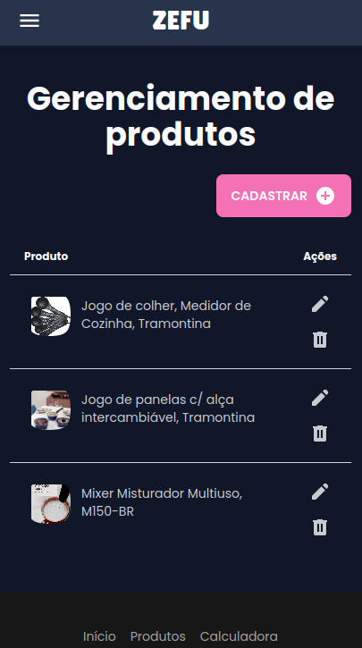
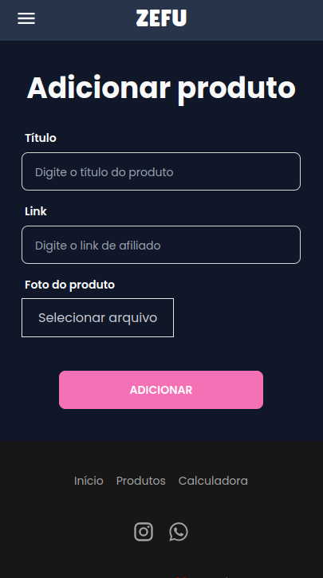

# Sistema ZEFU 👨🏼‍🍳

## Descrição
O sistema ZEFU foi desenvolvido com o objetivo de atender a demanda de um cliente a qual possui um Instagram voltado à culinária fitness e pretendia reunir os produtos a qual ele era afiliado pela Amazon em um só lugar para que seus seguidores pudessem ter uma melhor experiência para visualizar os produtos a qual ele recomenda. Além disso, aos usuários que realizam o login (se tornam um lead) ele disponibiliza uma ferramenta para calcular de acordo com seus dados a quantidade média de calorias gastas e os macronutrientes recomendados. 
Para facilitar a adição de produtos, também há uma página direcionada para esse fim, sendo possível, adicionar, listar, editar e excluir. Após a ação, ela é refletida automaticamente nos produtos exibidos dentro do site.

### Navegação

### Produtos

  
  

#### Link
https://client-zefu.onrender.com/

#### API
https://github.com/hllrdev/api-zefu

